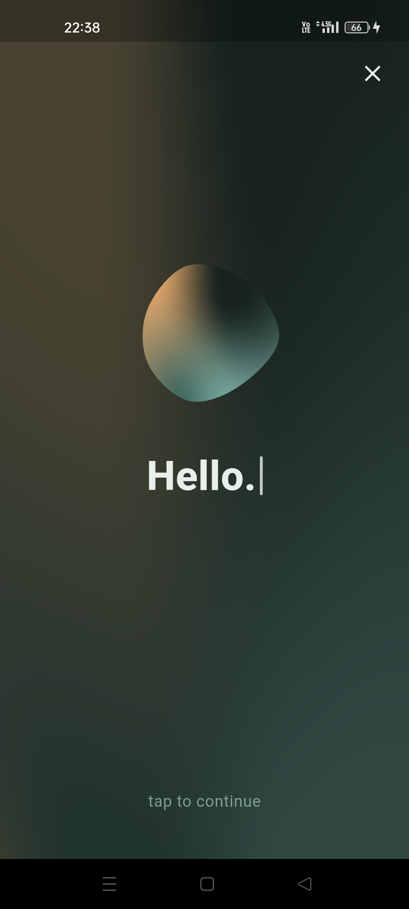
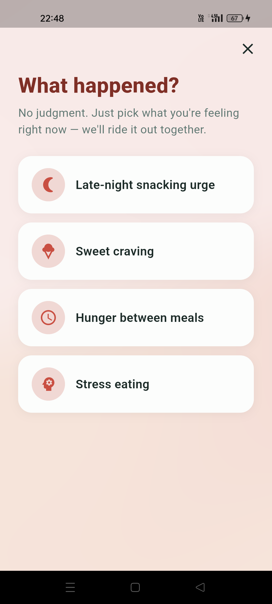

# Diet App — AI + Human Dietitian Nutrition Assistant

A Flutter nutrition app that pairs an AI nutrition assistant with **real human
dietitians**. Users get AI-generated, personalised meal plans for day-to-day
support, and message an assigned dietitian for anything that needs a human.

Built with Flutter, Supabase (Postgres + RLS + Realtime) and Gemini, running
behind Supabase Edge Functions.

> Status: working MVP. Turkish and English, both shipped from day one.

<!-- Ekran görüntülerini assets/screenshots/ altına koyup bu bloğu aç:
<p align="center">
  
  
  
</p>
-->

## Why this project

Most AI diet apps stop at generating a plan. The thing people actually pay a
dietitian for is the follow-up — the question that comes up at 11pm, the plan
that needs adjusting because you hate half of it. This app tries to digitise
that relationship rather than replace it:

- **AI for volume, humans for judgement.** The AI handles plan generation,
  revisions and everyday questions. A real dietitian is one tab away.
- **An "emergency button".** A one-tap guided flow for the moment willpower
  breaks — late-night snacking, a sugar craving. It walks the user through a
  short scripted intervention (drink water, wait 10 minutes, here's a swap)
  before they act. Deliberately mostly non-AI: near-zero cost, instant response.
- **Plans that adapt.** Revision keeps the parts the user didn't complain about
  and rewrites only what they pushed back on.

## Features

- Multi-step onboarding that builds a detailed health profile (age, weight,
  goals, medical history, allergies, dietary style, trigger moments)
- AI-generated 7-day meal plans as **structured JSON**, not free text —
  per-meal rendering, calories and macros
- Plan revision driven by user feedback
- AI nutrition chat, grounded in the user's stored health profile
- Realtime messaging with an assigned dietitian
- Meal and water logging, weight/measurement progress charts
- Emergency support flow with outcome logging
- Full Turkish/English localisation (343 keys)

## Tech stack

| Layer | Choice | Why |
|---|---|---|
| Mobile | Flutter | Single codebase for iOS + Android |
| Backend | Supabase (Postgres) | Auth, Realtime and row-level security out of the box, with real SQL underneath |
| AI | Gemini via Supabase Edge Functions (Deno) | Keeps the API key server-side and cost controls in the database |
| Charts | `fl_chart` | Progress visualisation |
| i18n | `flutter_localizations` + ARB | Localisation built in from the start |

## Security model

This is the part I spent the most time getting right, so it's worth calling out.

- **No secrets in the client.** The Supabase anon key ships in the app by
  design — it carries no privileges, and access is decided entirely by RLS
  policies. The Gemini API key never leaves the server; it exists only as a
  Supabase secret inside the Edge Function.
- **Closed by default.** `schema.sql` enables RLS on every table *before* any
  policy exists. A table with no policy is a table nobody can read — so
  forgetting a policy fails closed, not open.
- **Sensitive health data is isolated.** Age, weight, medical history and
  allergies live in a separate `health_profiles` table, so a dietitian seeing a
  user's name and seeing their medical history are two independent policy
  decisions (KVKK / GDPR special-category data).
- **Column-level privilege control.** RLS is row-scoped, not column-scoped. A
  security review found that a user could set their own `profiles.role` to
  `dietitian`, and that a message recipient could rewrite the sender's `body`.
  Both are closed with column-level `GRANT`s in
  [`supabase/policies_hardening.sql`](supabase/policies_hardening.sql), with the
  reasoning documented inline.
- **AI cost is capped in the database.** A `SECURITY DEFINER` function does the
  quota check and counter increment in one atomic
  `INSERT ... ON CONFLICT ... WHERE count < limit`, so concurrent requests can't
  race past the daily limit. The client is never trusted with the counter.
- **The Edge Function runs under the user's JWT**, not `service_role` — it sits
  *inside* RLS, so a bug there cannot reach another user's data.

## Documentation

- [docs/ARCHITECTURE.md](docs/ARCHITECTURE.md) — system design, data model,
  security model and the trade-offs behind them
- [docs/SETUP.md](docs/SETUP.md) — running it from scratch

## Getting started

```bash
flutter pub get
flutter gen-l10n
flutter run
```

You'll need your own Supabase project and Gemini key — see
[docs/SETUP.md](docs/SETUP.md) for the full walkthrough (SQL run order, Edge
Function deploy, Realtime setup).

## Known limitations

- Dietitian registration and assignment are done server-side, not in-app
- No food database — calories are user-entered
- No payment or subscription layer
- Manual testing only; no automated test coverage yet

## License

MIT — see [LICENSE](LICENSE).
